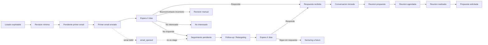

# Funnel Map v1 — IA Mujeres

- Date: 2026-06-07
- Model: funnel comercial institucional con carril principal, carril de retargeting y carril de cierre/bloqueo
- Direction source: feedback humano validado en Fase 6.1

## Principio de diseno

El funnel se disena para conversacion institucional, no para automatizacion agresiva ni venta directa.

El primer email tiene un objetivo unico:

> conseguir conversacion o reunion.

No busca vender un curso ni cerrar una propuesta en frio.

## Funnel conceptual definitivo

```text
LISTADO
→ Revision minima
→ Primer email
→ Espera X dias
    ├── Responde
    │   → Conversacion iniciada
    │   → Reunion propuesta
    │   → Reunion agendada
    │   → Reunion realizada
    │   → Propuesta solicitada / siguiente paso
    │
    ├── No responde
    │   → Follow-up 1 / Retargeting
    │   → Espera X dias
    │   → Follow-up 2 / Retargeting
    │   → Nurturing a futuro
    │
    ├── Rebota / contacto incorrecto
    │   → Revision manual
    │
    └── Dice no
        → No interesado
```

## Mermaid



`email_opened` no debe ser stage principal; solo senal auxiliar si el tracking existe y es fiable.

## Interpretacion visual del canvas

| Color | Interpretacion | Estados |
|---|---|---|
| Azul | Operacion | Revision minima, pendiente primer email, primer email enviado, seguimiento pendiente. |
| Verde | Interes y avance | Respuesta recibida, conversacion iniciada, reunion propuesta, reunion agendada, reunion realizada, propuesta solicitada. |
| Amarillo | Espera / falta de respuesta / retargeting | Espera X dias, sin respuesta, follow-up, retargeting. |
| Rojo | Bloqueo o cierre | No interesado, bounce, contacto invalido, no procede, revision manual. |
| Morado | Relacion futura | Nurturing a futuro, reimpactar en otra campana, contenido/evento futuro. |

## Estados recomendados

### Estados operativos

| Estado | Que significa | Evento activador | Owner principal | Tarea generada | Criterio de salida |
|---|---|---|---|---|---|
| Pendiente revision | Registro aun no validado para contacto. | Importacion, flags de calidad o duda humana. | CRM + Humano | Revisar entidad, area, email, duplicados. | Apto para primer email o pasa a revision manual. |
| Pendiente primer email | Registro apto y listo para draft. | Revision minima completada. | CRM + Humano | Crear draft. | Draft aprobado o vuelve a revision. |
| Primer email enviado | Email 1 enviado desde cuenta autorizada. | `email_sent`. | GWS + CRM | Crear tarea de seguimiento. | Responde, rebota, dice no o entra en espera. |
| Seguimiento pendiente | Hay que esperar o preparar siguiente impacto. | Email enviado sin respuesta inmediata. | CRM + Humano | Revisar ventana de seguimiento. | Respuesta, follow-up o nurturing. |
| Sin respuesta | No hay respuesta tras la ventana definida. | Vence X dias sin reply. | CRM + Humano | Decidir follow-up o nurturing. | Follow-up, respuesta posterior o nurturing. |
| Nurturing a futuro | No hay conversacion actual, pero no se quema el contacto. | Sin respuesta persistente o timing no adecuado. | CRM + Humano | Programar reimpacto futuro. | Reapertura en otra campana o archivo. |

### Estados de avance / interes

| Estado | Que significa | Evento activador | Owner principal | Tarea generada | Criterio de salida |
|---|---|---|---|---|---|
| Respuesta recibida | Llega reply util o relevante. | `reply_received`. | GWS + CRM + Humano | Leer, clasificar y contestar. | Conversacion, no interesado, derivacion o review. |
| Conversacion iniciada | Hay intercambio con sustancia. | Humano confirma interes o contexto util. | Humano + CRM | Mantener conversacion. | Reunion propuesta o nurturing. |
| Reunion propuesta | Se propone una reunion o formato equivalente. | Humano ofrece llamada, videollamada o encuentro. | Humano + CRM | Seguimiento de agenda. | Reunion agendada o pausa. |
| Reunion agendada | Existe fecha o acuerdo operativo. | Confirmacion de agenda. | Humano + CRM | Preparar reunion. | Reunion realizada o reagendada. |
| Reunion realizada | La conversacion sincronica ocurrio. | Registro humano post-reunion. | Humano + CRM | Nota y siguiente accion. | Propuesta solicitada, nurturing o cierre. |
| Propuesta solicitada | La entidad pide propuesta o siguiente paso formal. | Solicitud explicita. | Humano + CRM | Preparar propuesta. | Propuesta enviada o pausa. |

### Estados de cierre / bloqueo

| Estado | Que significa | Evento activador | Owner principal | Tarea generada | Criterio de salida |
|---|---|---|---|---|---|
| No interesado | La entidad dice que no o no procede. | Reply negativo o decision humana. | Humano + CRM | Registrar motivo. | Cierre limpio. |
| Bounce / contacto invalido | El email rebota o el contacto no sirve. | `bounce_detected` o revision humana. | GWS + CRM + Humano | Buscar contacto alternativo o marcar invalido. | Revision manual, correccion o archivo. |
| Revision manual | Hay ambiguedad, duplicado o bloqueo de datos. | Flag de calidad, bounce, contacto incorrecto o duda. | Humano + CRM | Limpiar datos. | Vuelve a pendiente primer email o se descarta. |

## Senales y eventos

| Senal / evento | Tipo | Uso |
|---|---|---|
| `draft_created` | Operativo | Control de preparacion, no conversion. |
| `email_sent` | Operativo | Activa espera y seguimiento. |
| `email_opened` | Senal debil | Auxiliar para retargeting si existe y es fiable; no stage. |
| `reply_received` | Evento fuerte | Saca del carril automatico y crea tarea humana. |
| `bounce_detected` | Bloqueo | Pasa a revision manual o contacto invalido. |
| `meeting_proposed` | Avance | Indica conversacion con siguiente paso. |
| `meeting_booked` | Conversion real | Conversion primaria del primer tramo. |
| `proposal_requested` | Conversion posterior | Interes cualificado post-reunion. |

## Retargeting y no respuesta

`Sin respuesta` no es cierre automatico. Es un estado temporal que alimenta:

- follow-up 1;
- follow-up 2;
- nurturing a futuro.

Reglas:

- No respondio + no abierto: si hay tracking fiable, probar asunto o angulo distinto.
- Abierto + no respondio: follow-up mas suave, sin mencionar la apertura.
- Respondio: sale del carril automatico y pasa a humano.
- Sin tracking fiable de apertura: operar solo con enviado, respuesta, bounce y reuniones.

## Traduccion al CRM actual

No todos los conceptos tienen que ser stages. Conviene separar:

- stages comerciales;
- `outreach_status`;
- senales/eventos;
- tareas humanas.

| Concepto comercial | Tipo recomendado | Notas |
|---|---|---|
| Pendiente revision | Stage o flag de calidad | Puede ser `needs_manual_review`. |
| Pendiente primer email | Outreach status | Listo para draft. |
| Primer email enviado | Outreach status/evento | Activado por `email_sent`. |
| Seguimiento pendiente | Tarea/outreach status | Controla espera y follow-up. |
| Sin respuesta | Estado operativo temporal | No cierre. |
| Nurturing a futuro | Stage o lista futura | Relacion futura, no perdida. |
| Respuesta recibida | Evento fuerte + tarea | Requiere humano. |
| Conversacion iniciada | Stage comercial | Humano interpreta. |
| Reunion propuesta | Stage/tarea | Humano propone. |
| Reunion agendada | Conversion primaria | Meeting booked. |
| Propuesta solicitada | Stage posterior | Tras reunion o interes cualificado. |
| No interesado | Cierre negativo | Registrar motivo. |
| Bounce / contacto invalido | Evento de bloqueo | Revision manual. |
| email_opened | Senal auxiliar | No stage comercial. |

## Ownership por sistema

### CRM / Twenty

Fuente de verdad para:

- deals;
- estado comercial;
- Business Line;
- Campaign;
- prioridad;
- segmento;
- revision manual;
- tareas;
- reuniones;
- notas;
- nurturing futuro.

### GWS CLI

Fuente operativa para:

- drafts;
- envios;
- `message_id`;
- `thread_id`;
- respuestas;
- bounces si estan disponibles;
- aperturas solo si existe tracking fiable.

### Humano

Responsable de:

- validar listas;
- aprobar drafts;
- responder a interesados;
- proponer reunion;
- mantener conversacion;
- decidir cuando pasar a propuesta;
- ajustar tono;
- interpretar senales institucionales.

## Conversiones

- Conversion primaria: `Reunion agendada` / `meeting_booked`.
- Conversion secundaria: respuesta positiva o conversacion iniciada.
- Conversion posterior: propuesta solicitada.
- No conversion temporal: sin respuesta.
- Cierre negativo real: no interesado, bounce/contacto invalido, no procede.

## Reglas de avance

- Ningun registro con `needs_manual_review=true` sale a primer email.
- Un email generico de area puede avanzar si el area es correcta y el copy pide derivacion con respeto.
- `email_opened` no equivale a interes.
- `reply_received` no equivale automaticamente a oportunidad cualificada, pero si exige intervencion humana.
- `Sin respuesta` no debe cerrar la oportunidad de forma automatica.
- `Propuesta solicitada` solo aparece tras conversacion real o interes explicito.
