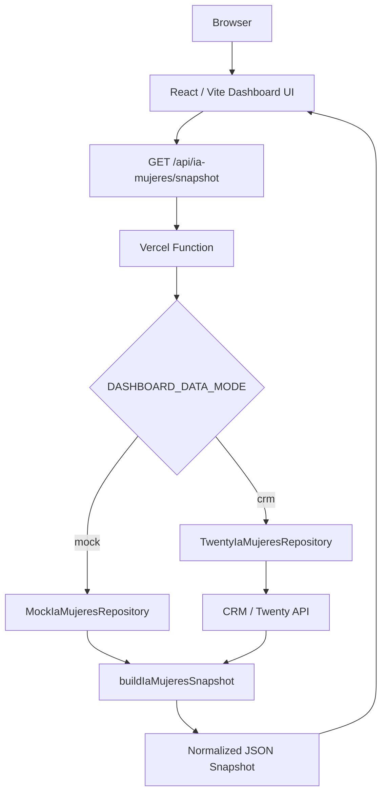

# Dashboard Architecture — 2026-06-12

## Summary
The IA Mujeres Dashboard is a read-only operational dashboard deployed on Vercel. It renders a dashboard-owned snapshot built by the dashboard server from CRM/Twenty or mock data.

The app will live at repository root alongside the scaffold folders.

## Canonical Flow

```text
Browser
  -> Dashboard UI
  -> /api/ia-mujeres/snapshot
  -> Vercel Function
  -> CRM/Twenty
  -> buildIaMujeresSnapshot()
  -> UI
```



## Boundaries

## Read-Only Boundary
- MVP may read CRM data and show metrics, tasks, alerts and next actions.
- MVP must not send emails, create drafts, edit CRM records, change stages, delete data or execute batch actions.
- Any future write-back requires a separate ADR, permissions, confirmation UX, audit logging and rollback plan.

## Server-Only CRM Boundary
- Browser code only calls dashboard API endpoints.
- CRM/Twenty access lives in server modules and Vercel Functions.
- CRM secrets are read only from server environment variables.
- `VITE_CRM_API_KEY` is forbidden.
- Debug panels must not expose secrets, full CRM payloads or email bodies.

## Vercel Deployment Boundary
- Root Vite app builds for Vercel.
- Root `api/` functions provide snapshot and refresh endpoints.
- Runtime secrets are configured in Vercel, not committed.
- Real-data deployments must be protected by Vercel Deployment Protection, Basic Auth or another approved auth layer.

## Why The Dashboard Owns The Snapshot
- The dashboard has UI-specific needs that differ from the CRM.
- The frontend should not know Twenty object shape, field names or pagination.
- A dashboard-owned snapshot creates a stable contract between server data and UI.
- The CRM remains the source of truth; the snapshot is a read-only projection.
- This avoids requiring `skilland-crm` to generate static files for the dashboard runtime.

## Future Root Structure

```text
00_inbox/
01_harness/
02_context/
03_specs/
04_outputs/
05_scratch/
shared/

src/
api/
server/
public/
package.json
vite.config.ts
vercel.json
.env.example
```

## Data Modes
- `mock`: default local mode; no CRM credentials needed.
- `crm`: server-side Twenty API mode after runtime URL/key/schema are verified.
- `custom`: reserved for a future read-only service or endpoint if Twenty API is insufficient.

## Failure Model
- CRM unavailable: return safe `error` or `partial` snapshot.
- Unknown stage: map to `UNKNOWN_STAGE`, keep UI alive and emit warning.
- Missing field: set field to `null`/omit optional value and emit warning if it affects a metric.
- Empty CRM result: return zero totals and empty arrays.
